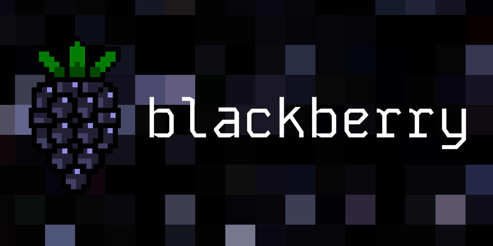

<div align="center">

<br />



<h1>blackberry.js</h3>

#### html components for the artisanal web

</div>

# Overview

[Documentation](https://blackberryjs.netlify.app)

Blackberry.js is a simple library for defining reactive components in HTML.

```html
<template blackberry="counter-component" attributes="initial">

    <button
        @click="increment"
        :text="`the count is ${count}`"
    ></button>

    <script>
        $state.count = Number($attributes.initial ?? 0);
        $state.increment = () => $state.count++
        $effect(() => console.log("count changed", $state.count));
    </script>

    <style>
        button {
            background: var(--blackberry-light);
            padding: 4px 8px;
            border: 2px solid var(--blackberry-accent);
            font-family: "VT323", monospace;
            font-size: 2rem;
            color: var(--blackberry-text);
            box-shadow: 4px 4px 0 var(--blackberry-dark);
            transition: all 90ms;

            &:hover {
                transform: translateY(-2px);
                box-shadow: 6px 6px 0 var(--blackberry-dark);
            }

            &:active {
                transform: translateY(2px);
                box-shadow: 4px 4px 0 var(--blackberry-dark);
            }
        }
    </style>

</template>
```

### License

Made with 💛

Published under [MIT License](./LICENSE).
